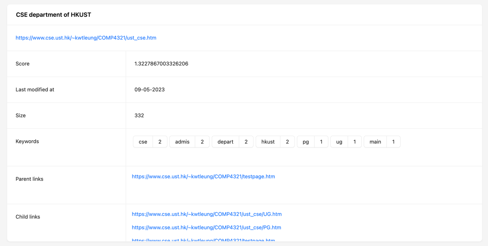
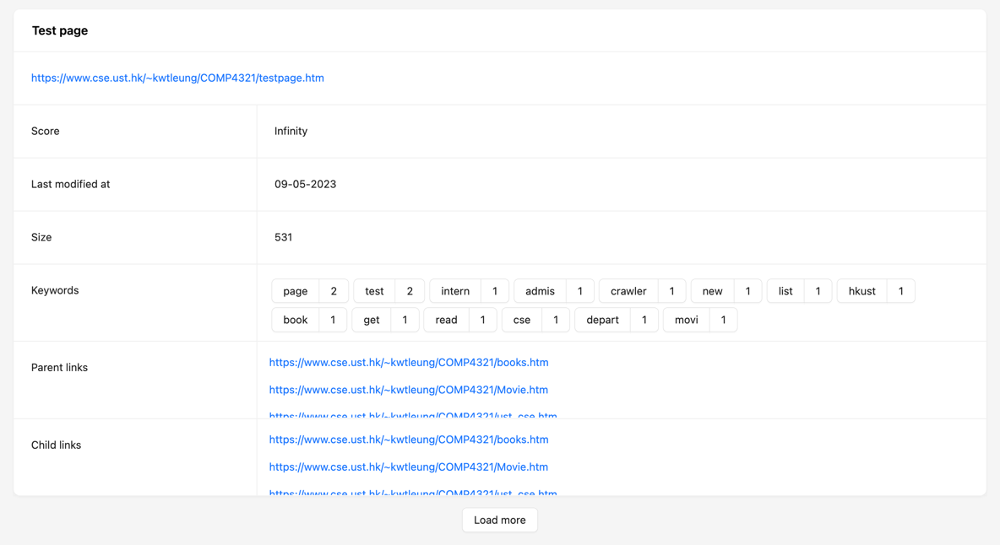

# COMP4321 Project Design

### Table of Content

1. [Overall Design](#overall-design)
2. [File Structure](#file-structure)
3. [Algorithms](#algorithms)
4. [Backend Service](#backend-service)
5. [Installation Procedure](#installation-and-getting-started)
6. [Special Features](#special-features)
7. [Testing](#testing)
8. [Conclusion](#conclusion)

<a name="overall-design"/>

## Overall Design

This project implements a front-to-back search engine that enables users to search webpages crawled by the system. The search functionality is supported by an optimized database design that reduces data iterations, and a phrase search capability that stores word positions in both the inverted index and forwardIndex of webpages. The system assigns weight to matches found in webpage titles, enhancing the accuracy of the results. The frontend is developed using ReactJS styled with antd, while the backend is built on Java with a JDBM database. In the sections below, we will elaborate on the architecture, algorithms, and other features of the system.

<a name="file-structure"/>

## File Structures

Using the JDBM library, data is stored as key-value pairs in the database.
The following hashmaps are used to store data in this project:

* *pages*: stores the information of all fetched webpages. Forward index is also supported in each page object.
* *url_to_id*: stores the mapping from a url to its webpage id from *pages* database.
* *inverted_index_body*: stores the inverted index of body content extracted from webpages.
* *inverted_index_title*: stores the inverted index of body content extracted from webpages.
* *word_to_id*: stores the mapping from a word (term) to its wordId, which is consistent with the *inverted_index*.

### Design principle

Striving a balance between minimizing storage and efficiency by designing minimal database tables while ensuring speedy
response can be
delivered upon a query prompt.
The database is designed to achieve simplicity that can help reduce the risk of errors
and inconsistencies in the data. Storage of data can also be optimized with a simplistic database.
Despite the goal to achieve minimalistic design, duplicative data such as forward index and *term_to_id* are however
implemented
to deliver prompt response by avoiding the excessive data iterations. Forward index helps accelerate document (page)
deletion in the inverted index, whereas *term_to_id* table is created to find the id of a word (term)
quickly.

### Pages Database

Stored in *pages.db* and *pages.lg*. Can be visualized in output text file *spider_result.txt*

#### Structure

A hashmap (htree) that maps pageId to a Page object.

#### Page Object

Stores information of a webpage

Attributes

* `page_id`: (String)
* `url`: (URL)
* `lastModificationDate`: (LocalDateTime)
* `pageSize`: (int)
* `title`: (String)
* `body`: (ArrayList\<String>)
* `childLinks`: (HashSet\<URL>)
* `parentLinks`: (HashSet\<URL>)
* `forwardIndex`: (Hashtable\<String, Integer>) maps word to its term frequency (tf) in the page body
* `forwardIndexTitle`: (Hashtable\<String, Integer>) maps word to its term frequency (tf) in the page title

### Url to ID Database

Stored in *url_to_id.db* and *url_to_id.lg*. Can be visualized in output text file *url_to_id_result.txt*

#### Structure

A hashmap (htree) that maps URL to the page ID of a Page object.

### Inverted Index Database (for both title and body)

Stored in *inverted_index_body.db*, *inverted_index_body.lg*, *inverted_index_title.db* and *inverted_index_title.lg*.
Can be visualized in output text file *indexer_body_result.txt* and *indexer_title_result.txt*.

#### Structure

A hashmap (htree) that maps wordId to a Term object.

#### Term Object

Stores information of a word (term)

Attributes

* `wordId`: (String)
* `word`: (String)
* `df`: (int) document frequency
* `postingList`: (ArrayList\<Posting>)

#### Posting Object

Stores information of the occurrence of a word (term) in different documents (pages)

Attributes

* `pageId`: (String)
* `tf`: (int) term frequency
* `positions`: (ArrayList\<Integer>) positions of the term in the webpage. To support phrase search.

### Term to ID Database

Stored in *word_to_id.db* and *word_to_id.lg*. Can be visualized in output text file *term_to_id.txt*.

#### Structure

A hashmap (htree) that maps word (term) to its wordId, which is consistent with inverted indexes.

### Frontend Capabilities

....

<a name="algorithms"/>

## Algorithms

### Phrase Search

Phrase search is enabled by storing the position of each word into the *inverted_index* and the `forwardIndex` of
webpages. When a query with phrase is requested, the Search Engine will loop through each word in the phrase and maps
the webpage ID to the array of positions in which the word appears. For a given webpage, if the positions of the
previous word is in front of any of the positions of the current word, then a phrase is found.

### Weights - TFxIDF

A match between the query and a webpage title are favoured over a match with the body. Hence a `TITLE_BONUS` of value
larger than 1 is multiplied to the title weight.

#### Tokenized query

* Match in webpage title: `weight = tf * idf * TITLE_BONUS / maxTf`
* Match in webpage body: `weight = tf * idf / maxTf`

`tf`: term frequency of a given term in a given webpage
`idf`: inverse document frequency of a given term
`maxTf`: normalization factor. term frequency of the most frequent term in a given webpage

#### Phrase query

* Phrase match in webpage title: `weight = pf * idfP * TITLE_BONUS / maxTf`
* Phrase match in webpage body: `weight = pf * idfP / maxPf`

`pf`: phrase frequency of a given phrase in a given webpage
`idfP`: inverse document frequency of a given phrase
`maxPf`: normalization factor. phrase frequency of the most frequent phrase in a given webpage

### Similarity Measure – Cosine Similarity

Cosine similarity is used to calculate the similarity between a query and a document (webpage).

$$ CosSim(D_i , Q) = {D_i \cdot Q \over \mid D \mid \mid Q \mid }$$

<a name="backend-service"/>

## Backend Service

### Server Class

A server that accepts HTTP requests to port 8000 from the frontend to crawl
webpages and search from the database when queried.

Endpoints

* `/crawl`: given a starting URL and the number of pages to be crawled, the Spider class starts crawling relevant
  webpages and stores their information in the database.
* `/query`: given a query, the handler search among the previously crawled pages and return the webpages with descending
  scores of cosine similarity.

#### Example

When queried *hkust* with `http://localhost:8000/query`, the following is the response from `/query`:

```
[
  {
  "score": "1.3227867003326206",
  "size": "332",
  "modifiedAt": 1683615287,
  "forwardIndex": [
    {
      "tf": 2,
      "word": "cse"
    },
    {
      "tf": 2,
      "word": "admis"
    },
    {
      "tf": 2,
      "word": "depart"
    },
    {
      "tf": 2,
      "word": "hkust"
    },
    {
      "tf": 1,
      "word": "pg"
    },
    {
      "tf": 1,
      "word": "ug"
    },
    {
      "tf": 1,
      "word": "main"
    }
  ],
  "childLinks": [
    "https://www.cse.ust.hk/~kwtleung/COMP4321/ust_cse/UG.htm",
    "https://www.cse.ust.hk/~kwtleung/COMP4321/ust_cse/PG.htm",
    "https://www.cse.ust.hk/~kwtleung/COMP4321/testpage.htm"
  ],
  "pageId": "63e00612",
  "title": "CSE department of HKUST",
  "body": [
    "cse",
    "department",
    "hkust",
    "cse",
    "department",
    "hkust",
    "pg",
    "admission",
    "ug",
    "admission",
    "main"
  ],
  "parentLinks": [
    "https://www.cse.ust.hk/~kwtleung/COMP4321/testpage.htm"
  ],
  "url": "https://www.cse.ust.hk/~kwtleung/COMP4321/ust_cse.htm"
 },
...
]

```

### Spider Class

Crawls information and hyperlinks from a given webpage url.

Public Methods

* `Spider(DatabaseManager recman, String url, int numPages)`: takes a DatabaseManager that
  handles interactions with the *pages* database, a starting URL and the limit to the number of pages to be fetched.
* `fetch()`: conducts a breadth-first search to extract hyperlinks from a webpage.
  It first checks whether a particular webpage should be fetched,
  then proceeds to extracting all required information from each webpage and stores
  them in a Page object. The Page object is then updated in the *pages* database.

Private Methods (helper functions)

* `exractPageSize(URL url)`
* `extractPageDate(URL url)`
* `extractChildLinks(URL url)`
* `extractTitle(URL url)`
* `extractBody(URL url)`
* `shouldFetch(URL url)`

### Indexer Class

Processes webpages from the *pages* database to extract keywords and updates *inverted_index* files.
Forward indexes for each webpage in *pages* is also updated.

Public Methods

* `Indexer(DatabaseManager recmanInvTitle, DatabaseManager recmanInvBody, DatabaseManager recmanTermToId)`: takes a
  DatabaseManager `recmanInvTitle` and `recmanInvBody` that handles interactions with the *inverted_index* databases.
  Within the constructor, another DatabaseManager that links to the *pages* database is created to load pages that were
  fetched beforehand.
* `process()`: for each webpage from the *pages* database, stopwords are removed and tokens from title and
  body are reduced to their stems. Tokens from titles and bodies of webpages are subsequently indexed to
  inverted index files. The inverted indexes and term-to-id map are then stored in the database.

Private Methods (helper functions)

* `indexing(ArrayList<String> body, String pageId, boolean isBody)`: counts occurrences and positions of each
  word (term) to update `forwardIndex` in each given webpage. It then updates a class variable `invertedFile`
  regarding each term information. It also maintains a mapping from word (term) to its wordId. Note that database has
  not been updated yet at this stage.
* `updateInvertedFile()`: updates *inverted_index* databases.
* `updateTermToId()`: updates *word_to_id* databases.

### SearchEngine Class

When given a query, this class computes weights and similarities of the query
against each of the crawled webpages that are stored in database.
Webpages are then ranked and returned.

Public Methods

* `SearchEngine(String inputQuery, int numResult, DatabaseManagers ...)`:
  sets up a search engine and process the query into phrases and tokens.
* `start()`: outputs a sorted map of pages according to their cosine similarity
  scores. In order to narrow down the amount of webpages searched,
  only the subset of pages that contain the first term of the query are searched.
  After which, the positions of the subsequent terms of the
  query are compared. If all terms are matched and positions
  are adjacent to each other then the phrase has been found.
  The weights of the matched webpages are then computed with tf * idf / maxTf,
  in which matches in the title are awarded with a bonus multiplier.
  Weights of each phrase match or token match in either title or body
  of a webpage are summed up. Query weights are also calculated in a similar
  mannner. With the weights of documents (webpages) and query, cosine
  similarity can be calculated, which serves as the scoring criteria of
  webpage ranking. Webpages are sorted in descending scores and returned as a map.

### Utils Class

Public Static Methods

* `removeStopWords(ArrayList<String> body)`:
  load stop words from `project/utils/stopwords.txt` and
  remove stop words from the passed ArrayList
* `stem(ArrayList<String> body)`:
  reduce all words from the passed ArrayList to their stem root
  form using the Porter algorithm,
  in order to support higher recall when searching.
* `splitQueryPhraseNormal(String inputQuery)`: processes and
  returns phrase query and token query.

<a name="installation-and-getting-started"/>

## Installation and Getting Started

The backend of project is developed in Java on IntelliJ.

### Backend

#### Dependencies

On IntelliJ, do to File > Project Structure > Project Settings > Libraries > add the
directory of this project's *utils* folder.

* `utils/htmlparser.jar`
* `utils/jdbm-1.0.jar`
* `utils/Porter.java`
* `utils/stopwords.txt`

#### Running

In `TestClass.java`, run

* `main()`: to start the server at port 8000 and accepts HTTP requests from the frontend.

### Frontend

* `cd client`: go to *client* directory
* `npm i`: install dependencies
* `npm start`: start frontend at port 3000.

<a name="special-features"/>

## Special Features

### Frontend

To optimize the user experience, the frontend of the search engine has been carefully designed to incorporate a range of features and design elements. These enhancements are intended to make the search process more intuitive, efficient, and enjoyable for users.

* Frontend pages are styled with AntD library to give a minimalistic yet informative look. It is also done to ensure themes are consistent throughout the whole website.
* The crawling and searching functions are separated into two pages with the use of react-router-dom. These two pages can be navigated to one another by clicking corresponding buttons.
* Cards are used to visualize each search result returned from the backend. To display all keywords, childlinks, and parent links without occupying an excessive amount of space, scrollable containers are implemented. Furthermore, to improve usability, keywords and their frequencies are presented in a clear and intuitive capsule format.

* The search engine simplifies the search process by allowing users to easily refine their search results with a single click. When browsing through search results, users can simply click on any relevant keyword to initiate a new search without having to type it in the search bar.

* The search engine also features a "Load More" button that enables users to easily display an additional 10 search results at a time. This helps to reduce frontend rendering time, particularly when dealing with a large number of search results.


### Output Files

In order to facilitate development and streamline the debugging process, our search engine stores data in both .db and .lg formats. However, in some cases, these formats may not provide sufficient information visualization. To address this, after each crawl, the database is also outputted as a text file in the *output* folder, enabling more thorough analysis and troubleshooting.

<a name="testing"/>

## Testing

Main functions of the project are tested in the TestClass. Run the below functions in `TestClass.java` to test the Spider, Indexer and SearchEngine.

* `testSpiderIndexer()`: to crawl data from webpages given a starting URL, and indexes all fetched webpages. Results
  from indexer and spider are outputed as textfiles and stored in the *output* folder.
* `testSearchEngine()`: to search with SearchEngine and return a map of webpages in descending order of its cosine
  similarity score.


<a name="conclusion"/>

## Conclusion

### Strengths

The search system under consideration has several strengths. Firstly, it employs a simple and optimized database design, which enhances performance by reducing data iterations. Additionally, the search functionality is robust, allowing for phrase search capability by storing word positions in both the inverted index and forwardIndex of webpages. Furthermore, weight is assigned to give prominence to matches found in webpage titles over those found in the body, which further enhances the accuracy of the results. Lastly, the system boasts an intuitive and user-friendly interface, which makes it easy to navigate and utilize.

### Weaknesses

However, the system also has some weaknesses that could be addressed to improve the user experience. Firstly, the implemented system does not handle spelling errors or provides suggestions for alternative queries. This could lead to poor results for users who mistype their queries. Additionally, the search engine has not taken measures to handle webpages with dynamic content, which could lead to outdated results being displayed.

### Future Improvements

To improve the system, several changes could be implemented, including spelling correction and relevance feedback to enhance search efficiency and result relevance. The use of a more robust database management system such as MySQL or MongoDB could also be considered to improve scalability and data management. Furthermore, implementing a web crawler capable of handling dynamic content would ensure that search results remain up-to-date.

### Possible Interesting Features

Interesting features that could be added to the search engine include personalized search results based on the user's search history and preferences, autocomplete and autosuggestion of search queries, and support for searching for images and videos. The integration of the system with other applications and platforms, such as social media, would also enhance its functionality and usefulness.

Designing and implementing a search engine project was a challenging yet fulfilling experience. I learned about web crawling, indexing, and querying, and applied these concepts to improve my programming skills. Witnessing the search engine function and produce relevant results was indeed gratifying. This project allowed me to acquire valuable experience in handling different technologies and tools that will aid me in my future career.


